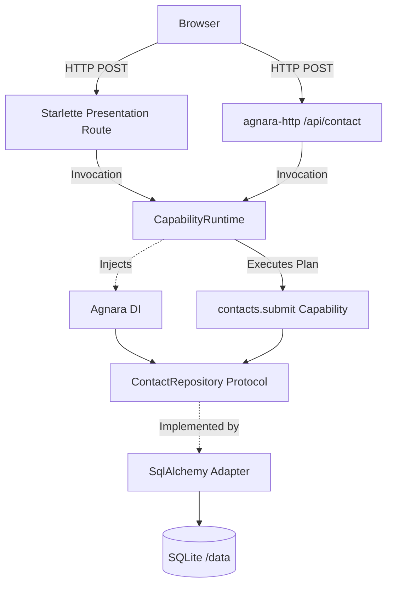

# Agnara Landing Reference

The Agnara presentation website, powered by Agnara itself.

This repository is both a presentation website for Agnara and an executable reference application demonstrating Agnara 1.0.3 as the application runtime.

## What this demonstrates

This repository answers the question: *"What does a real web application look like when Agnara is the application runtime?"*

It demonstrates that a web framework (Starlette) can host the application, but the actual semantic execution belongs entirely to Agnara.

## Architecture



### Agnara Responsibilities
* **Capability Model**: Defines `contacts.submit`, `contacts.dashboard`, etc.
* **Registry & Compilation**: Compiles schemas, policies, and dependencies before execution.
* **Dependency Injection**: Injects `SqlAlchemyContactRepository` via `DIRegistry` and `@provider`.
* **Policies**: Verifies scopes (e.g. `contacts:write`) against `Principal`.
* **Runtime Invocation**: Coordinates execution via `CapabilityRuntime`.
* **Canonical Outcomes**: Returns `Success` or `Failure`.

### Supporting Libraries
* **Starlette**: ASGI host, Jinja2 template rendering, authentication sessions.
* **SQLAlchemy & SQLite**: Persistence layer.
* **Jinja2**: HTML rendering.
* **Uvicorn**: ASGI Server.

## Quick Start

```bash
cp .env.example .env
uv sync
uv run python scripts/create_admin_hash.py 
# Update ADMIN_PASSWORD_HASH in .env

# Run server
make dev
```

### Docker
```bash
docker compose up --build
```
The database persists inside a Docker volume mounted at `/data/agnara.db`.

## Capabilities

Defined in `app/apps/contacts/capabilities.py`.

## HTTP API & OpenAPI

The `contacts.submit` capability is exposed directly via `agnara-http` at `POST /api/contact`.
OpenAPI documentation is available at `/api/docs` and `/api/openapi.json`.

## Admin

Admin routes require Starlette session authentication, which maps to an Agnara `Principal` with specific scopes. The `CapabilityRuntime` enforces these scopes before executing any admin capabilities.

## Agents

This repository is designed to be fully Agent-readable. Read `AGENTS.md`.
