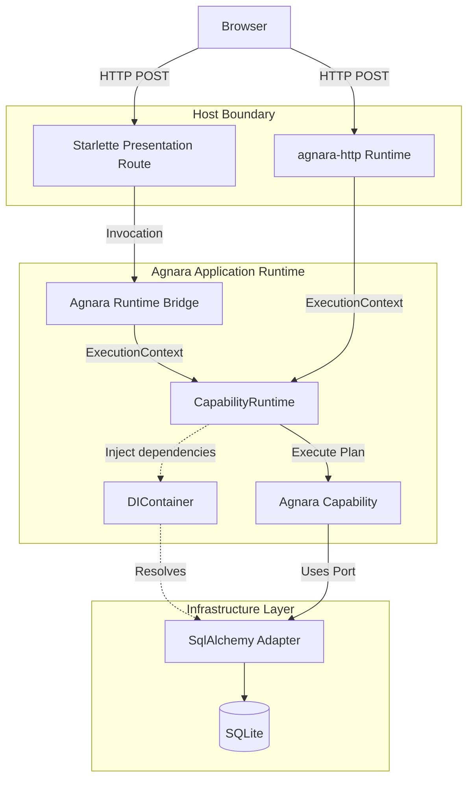

# Architecture

This project is built around the philosophy that **Agnara is the application runtime**, while other technologies act as hosts, adapters, or presentation layers.

## The Execution Graph

## Direct Host Execution vs Native Agnara HTTP

The diagram above illustrates the two ways a capability is reached:

1. **Direct Host Execution**: A user visits the HTML landing page and submits a form. Starlette catches the POST, verifies CSRF, maps the payload into a plain Python dictionary, and passes it to the `Agnara Runtime Bridge`. The bridge constructs an `Invocation` and `ExecutionContext`, then calls `CapabilityRuntime.invoke_result()`.
2. **Native Agnara HTTP**: A client sends a POST to `/api/contact`. The request is intercepted by the ASGI application compiled by `agnara-http`. It binds the `FORM` payload to the capability's schema natively, constructs an `ExecutionContext`, and calls `CapabilityRuntime.invoke_result()`.

In both cases, execution semantics converge identically at the `CapabilityRuntime`. Validation, dependency injection, policies, and telemetry are enforced uniformly.
