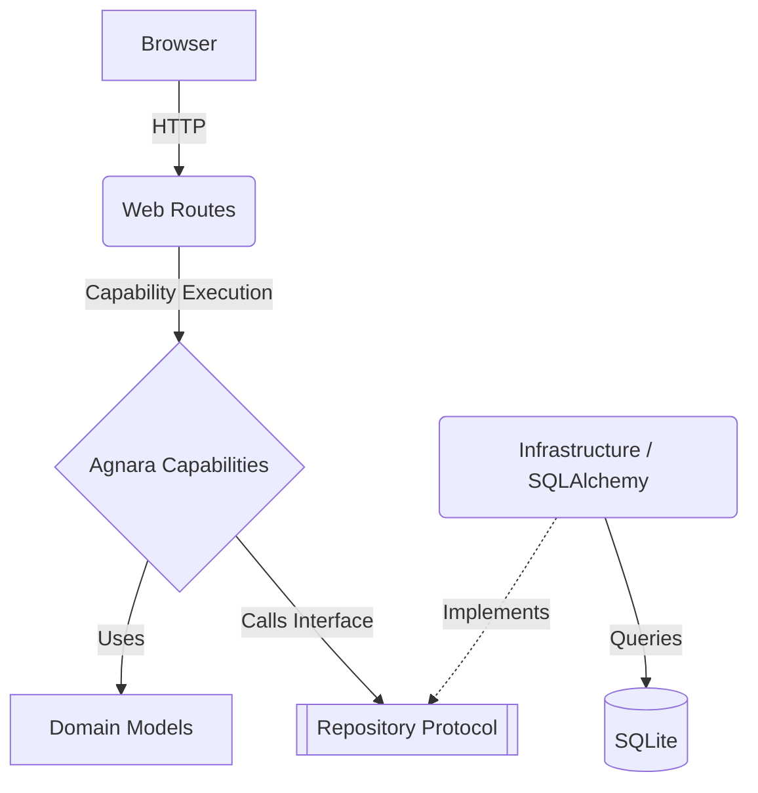

# Architecture

This project follows a strict **Agnara-first** architecture, implementing a clear separation of concerns.

## Principles

1. **Agnara as Core**: Business logic and application boundaries belong in Agnara capabilities.
2. **Dependency Injection**: Capabilities depend on abstract contracts (Protocols), not concrete implementations (like SQLAlchemy).
3. **Web as a Detail**: Starlette handles HTTP requests, sessions, and Jinja2 templates, but delegates all business operations to Agnara capabilities.

## Layers

### 1. Domain (`app/domain/`)
- Contains pure Python types and Data Classes (e.g., `ContactSubmission`).
- Contains Protocols/Interfaces (e.g., `ContactRepository`).
- Has no dependencies on the database or the web framework.

### 2. Capabilities / Application (`app/capabilities/`)
- Agnara Capabilities represent the use cases (e.g., `submit_contact`, `dashboard_stats`).
- They orchestrate domain objects and repository contracts.
- They enforce business validation and logic.

### 3. Infrastructure (`app/infrastructure/`)
- Implements the contracts defined in the Domain.
- Contains SQLAlchemy models, database connection logic, and the `SqlAlchemyContactRepository`.

### 4. Presentation / Web (`app/web/` & `app/templates/`)
- Handles HTTP requests using Starlette.
- Manages security (CSRF, Auth, Headers).
- Renders Jinja2 templates.
- **Rule**: Never imports or uses Infrastructure components directly. It always calls Agnara capabilities.

## Dependency Graph

